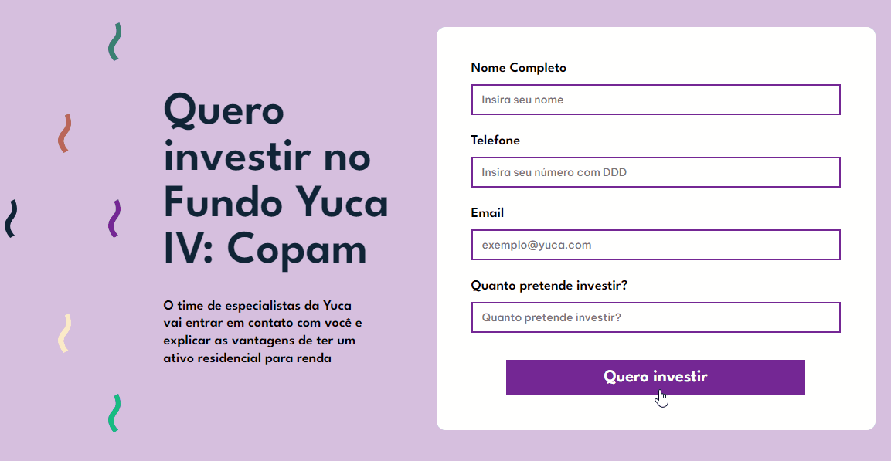
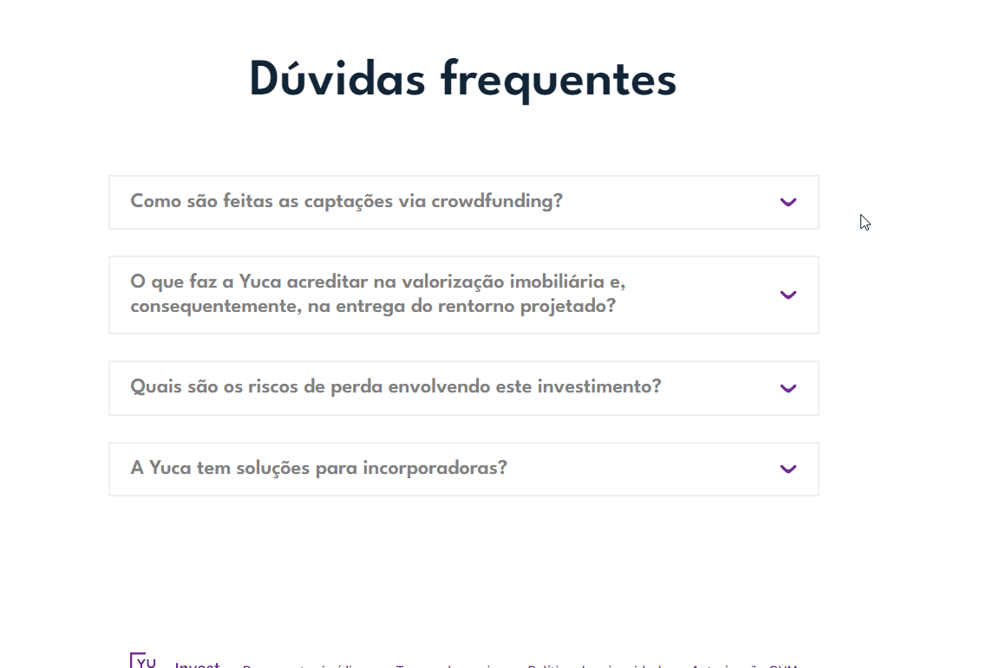

 

 
  

<h1 align="center"> Portófio </h1>

    <a href="#demo"> Demonstração</a> •
    <a href="#func"> Funcionalidade</a> •
    <a href="#tec"> Tecnologias</a> •
    <a href="#projeto"> Projeto</a> •
    <a href="#construção"> Em construção</a>
       

<h2 id="demo"> 📷 Demonstração </h2>

<h2 align="center">  </h2>
<h2 align="center">  </h2>
<h2 align="center">  </h2>
<h2 align="center">  </h2>
<h2 align="center">  </h2>

 

 

<h2 id="func"> ⚙ Funcionalidades </h2>

- [x] Página totalmente responsiva 
- [x] Slider carousel com React Slick 
- [x] Validação de formulário 
- [x] React Hooks e Custom Hooks 
- [x] Acessibilidade  

<h2 id="tec"> 🚀 Tecnologias </h2>

 Esse projeto foi desenvolvido com as seguintes tecnologias: 
 

✔️React  
✔️CSS  

<h2 id="projeto"> 💻 Projeto </h2>

Projeto foi desenvolvido em parceria com uma designer. Resultado final e alterações foram aprovados pela designer que produziu layout.

Projeto no Figma: https://www.figma.com/design/RvemE2l8xtMfqrZQVJyReE/ebac---invest?node-id=168-58&t=bD5r2kaKrcIwX2En-1

 

 Criado por Lucas Freitas 🖖🏽| <a href="https://www.linkedin.com/in/lucasfreitas01/"> Faça contato comigo </a> 

